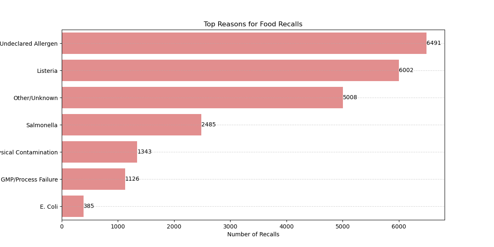

FDA Food Safety Enforcement Analysis

Project Overview:  
Goal: To audit 20,000+ FDA food recall records and identify the most critical breakdown points in food safety protocols. Tools Used: Python, Pandas (Data Analysis), Seaborn (Visualization), NLP (Text Cleaning).

Key Findings (The "Research" Part)
My analysis of the FDA Enforcement data (2008–2022) revealed:

Labeling is the #1 Failure: "Undeclared Allergens" are the most frequent cause of recalls (~6,400 incidents), surpassing biological pathogens. This indicates a systemic failure in labeling verification (CCP) rather than just sanitation.

Biological Hazards: Listeria monocytogenes (~6,000 incidents) is the dominant pathogen, highlighting the need for stricter Environmental Monitoring Programs (EMP).

Process Failures: Significant recalls were linked to "GMP Failures," showing gaps in basic sanitation and process controls.

Visual Evidence:  

How to Run This Project:  
Clone the repository.
Install requirements: pip install pandas, seaborn
Run FDA_Food_Safety_Audit.ipynb.
