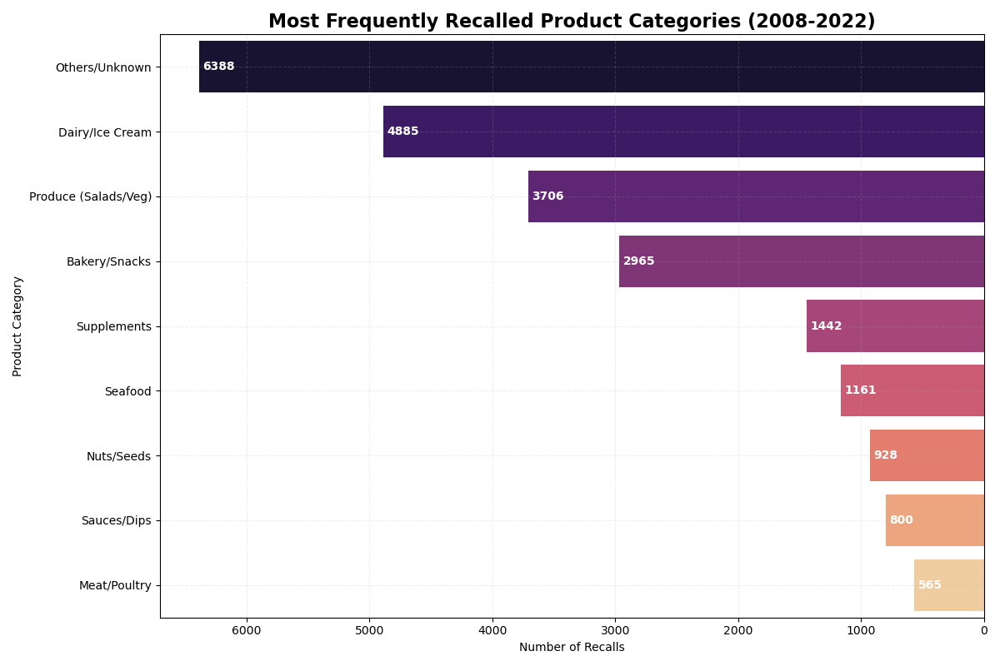

# FDA Food Safety Enforcement Analysis (2008–2022)

### Project Overview
**Goal:** To audit 20,000+ FDA food recall records and identify the most critical breakdown points in food safety protocols.
**Tools Used:** Python, Pandas (Data Analysis), Seaborn (Visualization), NLP (Text Cleaning).

### Key Findings (The "Research" Part)
My analysis of the FDA Enforcement data (2008–2022) revealed:

1.  **Labeling is the #1 Failure:** "Undeclared Allergens" are the most frequent cause of recalls (~6,400 incidents), surpassing biological pathogens. This indicates a systemic failure in labeling verification (CCP) rather than just sanitation.
2.  **Product Vulnerability (New Insight):** **Dairy/Ice Cream** and **Produce** are the highest-risk food categories. Surprisingly, Meat & Poultry recalls are comparatively low, suggesting that USDA "kill-step" regulations are more effective than controls in the cold-chain and raw agriculture sectors.
3.  **Biological Hazards:** *Listeria monocytogenes* (~6,000 incidents) is the dominant pathogen, highlighting the need for stricter Environmental Monitoring Programs (EMP) in ready-to-eat facilities.
4.  **Process Failures:** Significant recalls were linked to "GMP Failures," showing persistent gaps in basic sanitation and process controls.
## Comprehensive Data Story

### 1. The "Why": Root Cause Analysis
**Finding:** Labeling errors ("Undeclared Allergens") are the leading cause of recalls, statistically surpassing biological pathogens like Salmonella. This suggests a failure in documentation and verification (HACCP) rather than just sanitation.

---

### 2. The "What": Product Vulnerability
**Finding:** Contrary to consumer belief, raw meat is *not* the highest risk category. **Dairy/Ice Cream** (4,800+ recalls) and **Produce** (3,700+ recalls) are the primary drivers of enforcement actions. This highlights the risk of Listeria in cold-chain processing and E. Coli in raw agriculture.

---

### 3. The "When": Temporal Trends (2012-2022)
**Finding:** Recall events remained stable until a significant drop in 2020. This "COVID Gap" likely correlates with reduced on-site regulatory audits during the pandemic lockdown, representing a period of hidden risk in the supply chain.

---

### 4. The "Where": Supply Chain Hotspots
**Finding:** California is the central hub for recall events (~2,900), reflecting its volume of production. Notably, the data identifies active enforcement against Canadian imports (Ontario, Quebec), demonstrating the international scope of FDA jurisdiction.

How to Run This Project:  
Clone the repository.  
Install requirements: pip install pandas, seaborn  
Run FDA_Food_Safety_Audit.ipynb.  
